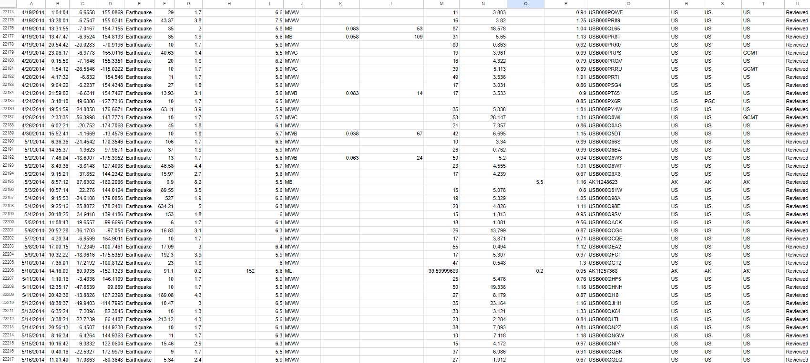

# Earthquake Data Visualization: Project Overview

## Background

Understanding earthquake data and its distribution worldwide is crucial for researchers and the public alike. Through this project, we leverage data science and visualization techniques to present earthquake data in a visually appealing and accessible manner.

The GUI application we are building aims to make earthquake data more understandable and engaging. Users will have the flexibility to explore seismic activity for different years, enabling them to identify patterns and trends over time. The continuous functionality of the GUI ensures a seamless experience while analyzing earthquake data for various periods.

By developing this earthquake data visualization application, we contribute valuable insights to researchers and the public, fostering a deeper understanding of global seismic activity and its changes over time. Our project showcases our proficiency in data handling, visualization, and creating practical, interactive applications for real-world applications.

## Objective 
The main aim of this data science project is to create a user-friendly application with a graphical interface to visualize earthquake data. The application will display the location and magnitude of significant earthquakes from various parts of the world over several decades. Our goals are as follows:

1. Read a .csv that has 23,413 entries of information for Date, Time, Latitude, Longitude, Type, Depth, DepthError, DepthSeismicStations, Magnitude, MagnitudeType, MagnitudeError. MagnitudeSeismicStations, AzimuthalGap, HorizontalDistance, HorizontalError, RootMeanSquare, ID, Source, LocationSource, MagnitudeSource & Status.
2. Develop an intuitive GUI that allows users to input a specific year and view a detailed world map highlighting significant earthquakes for that chosen year.
3. Provide historical trends of earthquake occurrences and emphasize the selected year's seismic activity on the map.
4. Ensure smooth functionality, allowing users to explore earthquake data for different years without the need to restart the application.

## Conclusion

Throughout this project on Earthquake Data Visualization, the primary objective of developing a user-friendly application with an intuitive graphical interface to analyze seismic activity has been successfully accomplished. By leveraging data science and advanced visualization techniques, the project transformed raw earthquake data into visually compelling and easily accessible representations.

The GUI application serves as a powerful tool, catering to both researchers and the general public, enabling them to gain valuable insights into the distribution and patterns of significant earthquakes over an extensive time span. The flexibility to explore seismic data for different years empowers users to identify trends and correlations, facilitating a deeper comprehension of global seismic activity.

One of the key strengths of this application is the seamless functionality, allowing users to analyze earthquake data without any disruptions. This feature enhances the user experience, facilitating in-depth investigations into historical trends and facilitating comprehensive earthquake analysis.

By creating this earthquake data visualization application, we make a significant contribution to the broader scientific community by presenting valuable insights into the dynamic nature of seismic events. The project showcases our expertise in data handling, sophisticated visualization techniques, and our ability to create practical, interactive applications for real-world use.

In conclusion, this earthquake data visualization project not only raises public awareness about seismic activity but also serves as a valuable resource for researchers to advance their understanding of earthquake patterns and implications. This project exemplifies my dedication to employing data-driven approaches to address real-world challenges.
